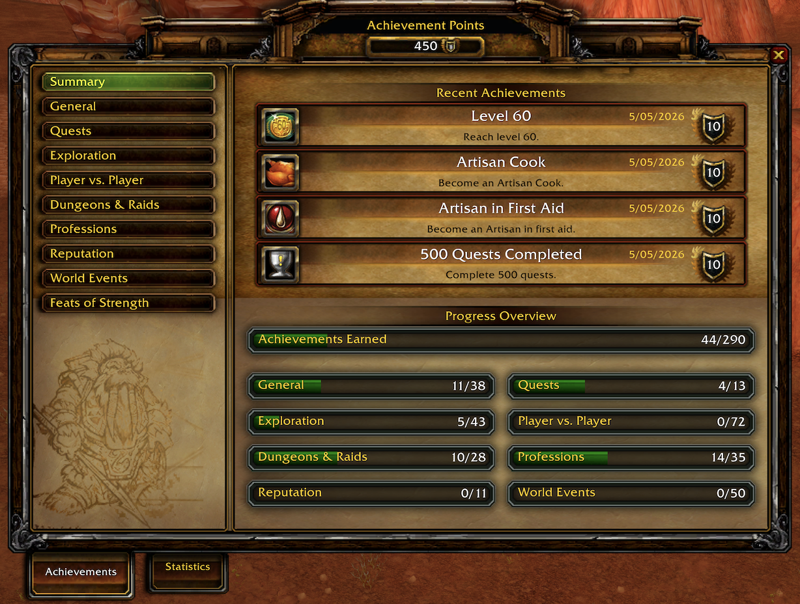
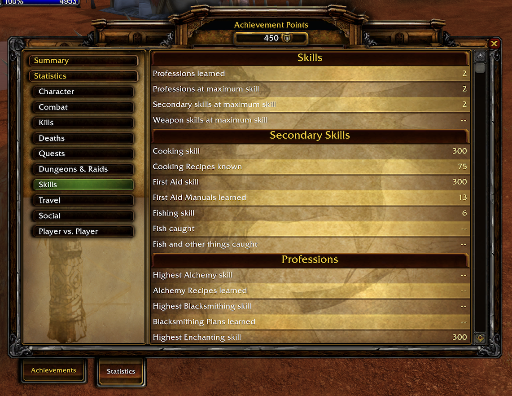
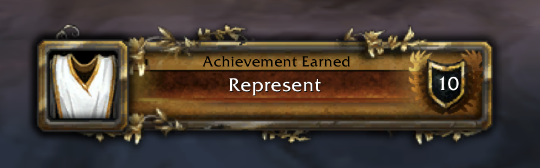
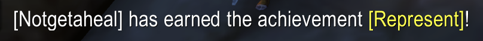
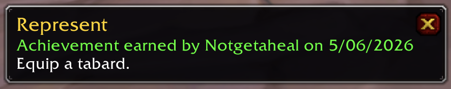
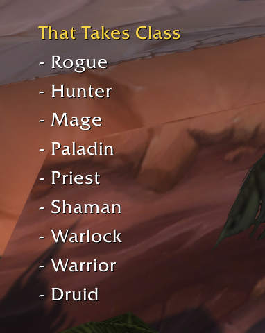
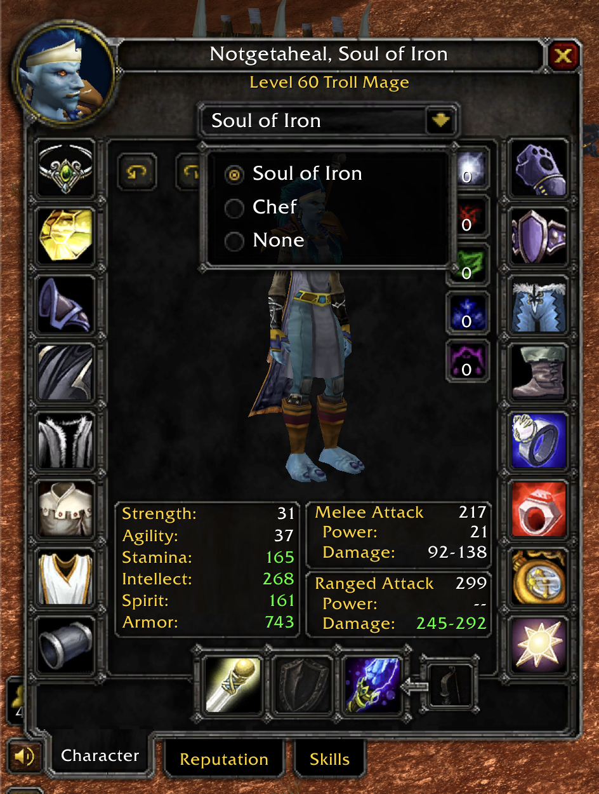

# Achievements

Achievements brings a Blizzard-style achievement system to World of Warcraft Classic Era and The Burning Crusade clients. It adds the achievement frame, statistics, achievement tracking, completion toasts, chat links, title rewards, social comparison, and a compatibility API for other addons.

## Supported Clients

- Classic Era (`11508`)
- The Burning Crusade / Anniversary (`20506`)

Both clients use achievement UI files bundled with the addon (a per-client copy under `Vanilla/` and `TBC/`). The native load-on-demand `Blizzard_AchievementUI` addon is never loaded: on Classic Era the client blocks it, and on The Burning Crusade loading it from an addon taints Blizzard's protected code and blocks logging out. A chat warning is shown if another addon force-loads `Blizzard_AchievementUI`.

## Required Addons

Achievements ships as two addon folders:

- `Achievements` is the runtime addon. It contains the UI integration, achievement API, tracking, saved progress, chat links, networking, comparison, guild announcements, title support, and compatibility fixes.
- `AchievementsData` is the required generated data addon. It contains the achievement database, categories, criteria, statistics, title data, localizations, and fallback icon assets.

Install both folders side by side:

```text
Interface/AddOns/Achievements
Interface/AddOns/AchievementsData
```

The bundled release zip includes both folders. A standalone `Achievements` zip expects `AchievementsData` to be installed beside it. If `AchievementsData` is missing, the runtime addon cannot load because it has no achievement data to display or evaluate.

## Quick Start

- Open Achievements from the micro button or with the default keybinding `Y`.
- Open Statistics with `SHIFT-Y`.
- Shift-click an achievement while a chat box is open to insert a clickable achievement link.
- Use the normal quest-watch tracking modifier on an achievement to track or untrack it on screen.
- Right-click another friendly player and choose `Compare Achievements`, or type `/ach-compare PlayerName`.
- Select earned achievement title rewards from the Character frame title dropdown, or use `/ach-title`.

## Screenshots

**Achievement Summary**



**Statistics**



**Achievement Earned Toast**



**Chat Announcement**



**Clickable Achievement Link**



**Tracked Objectives**



**Title Selection**



## Features

- **Blizzard-style achievement UI**: achievement categories, points, completion dates, criteria, rewards, summary views, and statistics in a familiar frame.
- **Classic and TBC data sets**: client-specific generated data for achievements, categories, criteria trees, statistics, quests, maps, reputations, factions, items, spells, skills, emotes, titles, and localizations.
- **Saved progress**: local character progress for supported Classic/TBC criteria, with account-wide storage reserved for account-wide achievement state and shared remote snapshots.
- **Completion feedback**: achievement toasts, local chat output, and addon-message achievement broadcasts visible to nearby or guild players running the addon.
- **Achievement tracking**: track incomplete achievements in a lightweight watch frame that updates alongside the quest tracker.
- **Clickable chat links**: achievement links work in Classic chat channels even on clients that normally strip unsupported achievement hyperlinks.
- **Player comparison**: compare achievements and statistics with another player running the addon through the right-click player menu or `/ach-compare`.
- **Armory-style snapshots**: fetch and store achievement snapshots from a player or from addon users in the hidden achievements channel with `/ach-fetch`.
- **Achievement title rewards**: earned title rewards can be selected from the Character frame or `/ach-title`; selected addon titles are shared with nearby addon users through group, guild, and addon-channel messages.
- **Retail-style API compatibility**: exposes familiar functions such as `GetAchievementInfo`, `GetAchievementCriteriaInfo`, `GetAchievementLink`, `GetStatistic`, `AddTrackedAchievement`, `RemoveTrackedAchievement`, comparison APIs, and achievement frame toggles for addon compatibility.
- **Data-only updates**: generated data and icon updates can be released through `AchievementsData` without replacing the runtime addon.

## Slash Commands

| Command | Description |
| --- | --- |
| `/ach-compare <name>` | Compare achievements and statistics with another player running the addon. |
| `/ach-fetch` or `/ach-fetch channel` | Request achievement snapshots from addon users in the hidden achievements channel. |
| `/ach-fetch player <name>` | Request a snapshot from one player. |
| `/ach-fetch show` | Show a summary of stored remote snapshots. |
| `/ach-fetch clear` | Clear stored remote snapshots. |
| `/ach-title` | List available earned title rewards. |
| `/ach-title <number>` | Select a title from the `/ach-title` list. |
| `/ach-title none` | Clear the selected addon title. |

Support/debug commands also exist for troubleshooting, but they are not needed for normal play.

## Data and Localization

The companion `AchievementsData` addon is generated from 3.4.5.63697 data and filtered for the supported clients:

- Classic Era: 386 achievements and 177 statistics.
- The Burning Crusade: 643 achievements and 254 statistics.
- Included localizations: `deDE`, `esES`, `esMX`, `frFR`, `koKR`, `ptBR`, `ruRU`, `zhCN`, and `zhTW`.

Runtime localization overlays are applied from `AchievementsData` based on your game client locale.

## Notes and Limitations

- This addon is a local Classic achievement system. It is not Blizzard's account-wide Retail achievement service.
- Progress depends on what the Classic client exposes through APIs, events, chat messages, saved variables, and generated data. Some achievements can be backfilled from current character state, while others only progress after the addon observes the relevant event.
- Social comparison, remote snapshots, title sharing, and guild achievement messages require other players to run a compatible version of the addon.
- Keep `Achievements` and `AchievementsData` from the same release whenever possible so runtime behavior and generated data stay in sync.

## Package Notes

- `Achievements` contains runtime Lua, bindings, UI integration, bundled Classic achievement UI files, media, saved-variable handling, and compatibility APIs.
- `AchievementsData` contains generated Lua data files and icon assets. It does not provide UI by itself.
- Both packages are released under the GNU GPL3 license.
